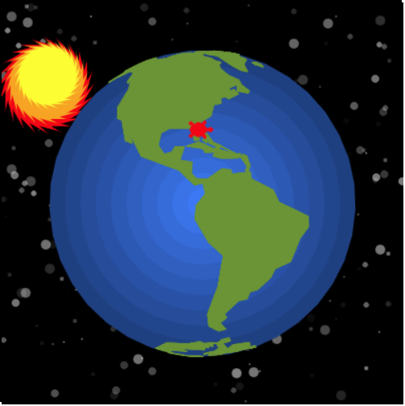

# Tracy the Turtle Projects

Projects for showing during an Hour of Code where students use [Code.org's Tracy the Turtle](https://codehs.com/hourofcode/tracy).

Check out [my blog post](https://tgratzer.com/post/tracy-the-turtle/) for more context.

